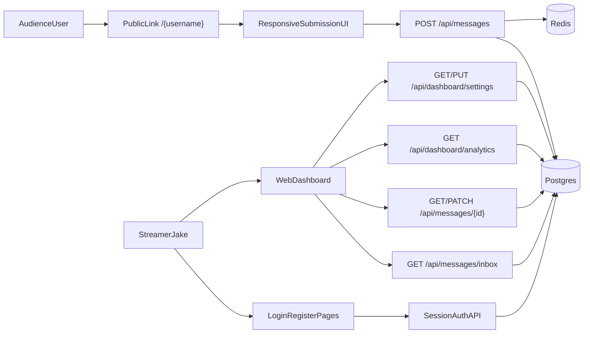

# Sendita — Web-First MVP Architecture

## Summary

This repository now implements a **web-first streamer Q&A MVP**:

- Jake registers with **email + password**
- Jake gets a permanent public question link at `/[username]`
- fans submit questions from mobile or desktop with no account
- Jake reads and moderates questions in a **browser dashboard**
- moderation is **classic rule-based**, not LLM-based
- auth is **session-cookie based**, not token-based in the product flow

The project keeps the durable public slug model and does **not** pivot to a `kahoot.it` room/session model for MVP.

## Architecture



## Monorepo Structure

```text
anon-inbox/
├── apps/
│   ├── api/       Next.js backend API
│   ├── web/       Next.js public site + streamer dashboard
│   ├── mobile/    legacy Expo / React Native app
│   └── admin/     internal moderation dashboard
├── packages/
│   ├── db/        Drizzle schema + migrations
│   ├── shared/    shared constants, types, utils
│   └── queue/     BullMQ queues
├── workers/
│   ├── moderation/
│   ├── push/
│   └── prompts/
└── tests/
    ├── unit/
    ├── integration/
    ├── security/
    ├── edge-cases/
    ├── race-conditions/
    └── e2e/web/
```

## Tech Stack

### Frontend

| Surface | Stack |
|---|---|
| `apps/web` | Next.js 15, React 19, TypeScript, Tailwind CSS |
| `apps/admin` | Next.js 15, React 19, TypeScript, Tailwind CSS |
| `apps/mobile` | Expo 52, React Native 0.76 |

### Backend

| Area | Stack |
|---|---|
| API | Next.js route handlers |
| Validation | Zod |
| Auth | session cookies + database-backed sessions |
| Password hashing | `bcryptjs` |
| Database | PostgreSQL |
| ORM | Drizzle ORM |
| Cache / spam limits | Redis |
| Queues | BullMQ |

### Product integrations

| Concern | Tooling |
|---|---|
| Fingerprinting | FingerprintJS |
| Error monitoring | Sentry |
| Billing | Stripe, deferred from MVP |
| Push notifications | Expo Push, deferred from MVP |
| Moderation | classic keyword and rule-based checks |

## What Is Implemented

### Public audience flow

- landing page in `apps/web/src/app/page.tsx`
- public submission page in `apps/web/src/app/[slug]/page.tsx`
- question submission UI in `apps/web/src/components/SubmissionPage.tsx`
- public profile lookup in `apps/api/src/app/api/links/[slug]/route.ts`
- question submission API in `apps/api/src/app/api/messages/route.ts`

### Streamer web dashboard

- login page in `apps/web/src/app/login/page.tsx`
- registration page in `apps/web/src/app/register/page.tsx`
- overview page in `apps/web/src/app/dashboard/page.tsx`
- inbox page in `apps/web/src/app/dashboard/messages/page.tsx`
- message detail page in `apps/web/src/app/dashboard/messages/[id]/page.tsx`
- analytics page in `apps/web/src/app/dashboard/analytics/page.tsx`
- moderation rules page in `apps/web/src/app/dashboard/moderation/page.tsx`
- account/settings page in `apps/web/src/app/dashboard/settings/page.tsx`

### Supporting APIs

| Method | Route | Purpose |
|---|---|---|
| `POST` | `/api/auth/register` | create streamer account and session |
| `POST` | `/api/auth/login` | log into dashboard |
| `GET` | `/api/auth/session` | fetch current session user |
| `POST` | `/api/auth/logout` | log out and revoke current session |
| `POST` | `/api/auth/refresh` | extend current session cookie |
| `GET` | `/api/messages/inbox` | list questions for Jake |
| `GET` | `/api/messages/[id]` | fetch one question |
| `PATCH` | `/api/messages/[id]` | mark read or change status |
| `GET` | `/api/dashboard/analytics` | dashboard summary counts |
| `GET/PUT` | `/api/dashboard/settings` | public link and moderation settings |

## Auth Model

The old device-secret + JWT model has been replaced in the product flow by:

- `users.email`
- `users.passwordHash`
- `user_sessions` table
- `anon_inbox_session` HTTP-only cookie

The public slug identity stays the same.

## Moderation Model

Moderation is no longer OpenAI or LLM based in the main product flow.

Each streamer can define:

- blocked keywords
- flagged keywords
- whether external links should be flagged

Those rules are stored on the `users` record and applied synchronously during submission. This makes the inbox usable immediately in the web app without depending on an AI moderation worker.

## Spam And CAPTCHA Policy

The current MVP spam policy is:

- allow up to **15** submissions per sender fingerprint in the active window
- after that, require a verification step
- keep Redis-backed idempotency and rate limiting
- keep honeypot and minimum-send-delay bot checks

## Database Model

### Core tables in use

| Table | Purpose |
|---|---|
| `users` | streamer account, slug, moderation settings |
| `user_sessions` | web session storage |
| `messages` | incoming encrypted questions |
| `message_metadata` | abuse and moderation metadata |
| `reports` | message reports |
| `analytics_events` | event tracking |
| `audit_log` | internal audit records |

### Deferred or legacy tables

| Table | Status |
|---|---|
| `device_sessions` | legacy mobile auth path |
| `hints` | deferred |
| `subscriptions` | deferred |
| `engagement_prompts` | deferred |

## MVP Route Map

### Public

- `/`
- `/[username]`

### Private

- `/login`
- `/register`
- `/dashboard`
- `/dashboard/messages`
- `/dashboard/messages/[id]`
- `/dashboard/analytics`
- `/dashboard/moderation`
- `/dashboard/settings`

## Railway Deployment

### Recommended MVP topology

| Service | Required? |
|---|---|
| `apps/web` | yes |
| `apps/api` | yes |
| Railway Postgres | yes |
| Railway Redis | yes |

### Optional / deferred

| Service | Status |
|---|---|
| `apps/admin` | internal only |
| `workers/moderation` | optional for future async workflows |
| `workers/push` | deferred |
| `workers/prompts` | deferred |
| `apps/mobile` | legacy / deferred |

## Product Recommendation

The current plan is sensible.

The best MVP path is:

- keep the permanent public slug link
- keep no-account audience submission
- keep responsive web as the primary product surface
- keep Railway as the deployment target
- keep Redis-backed anti-spam protections
- build everything Jake needs into the web dashboard

Do not switch to a Kahoot-style room/session architecture for MVP unless the product later requires live host-controlled session state.
